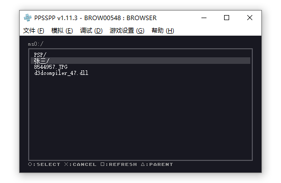
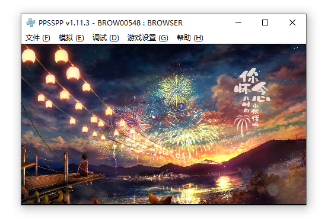
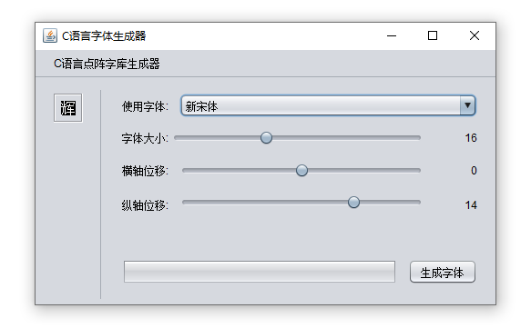

PSP - PIXELS
============
一个PSP游戏机项目。中文字库, 文件浏览器, 图片查看器。

# 功能展示

## 文件浏览器

## 图片查看器

## 字库生成器

# 设计思路

## UCS-2（Unicode编码）

**UCS-2**与**UTF-8**一样是字符的编码格式。

| UCS-2编码(16进制) | UTF-8 字节流(二进制) |
| ---- | --- |
| 0000 - 007F | 0xxxxxxx |
| 0080 - 07FF | 110xxxxx 10xxxxxx |
| 0800 - FFFF | 1110xxxx 10xxxxxx 10xxxxxx |

UCS-2 用 0x0000 - 0xFFFF 代表所有UTF-8的字符。
假设一个字符为16x16, 一个byte（8Bit）可以代表8个点, 32个byte就可以代表一个字, 2Mib刚好表示整个UCS-2字库。

PSP在使用的时候, 跟据UCS2编码可以直接算出偏移量, 并取出32个byte, 进行位运算, 打印出一个字符.

# 如何构建

## 环境准备

Java开发环境

PSP 开发环境 
- windows或者linux直接下载 [minpspw](https://sourceforge.net/projects/minpspw/files/SDK%20%2B%20devpak/pspsdk%200.11.2/) 安装即可
- mac只能选择编译安装 [psptoolchain](https://github.com/pspdev/psptoolchain), 要解决git的网络问题 (sudo命令, 需要给root的git设置代理) (那将是一个漫长的过程)

## 编译和运行
- maker : mvn compile , 进入target/class 运行 java charc.Main
- browser : make install , 将dist文件夹复制到 PSP的记忆棒 PSP/GAME/ 下

